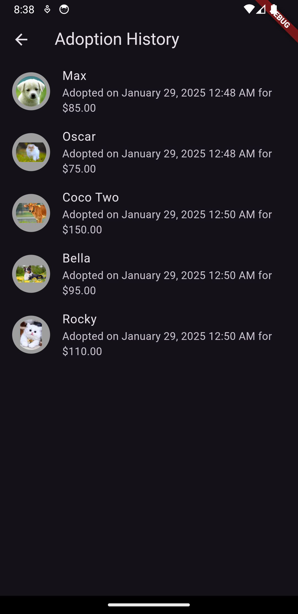
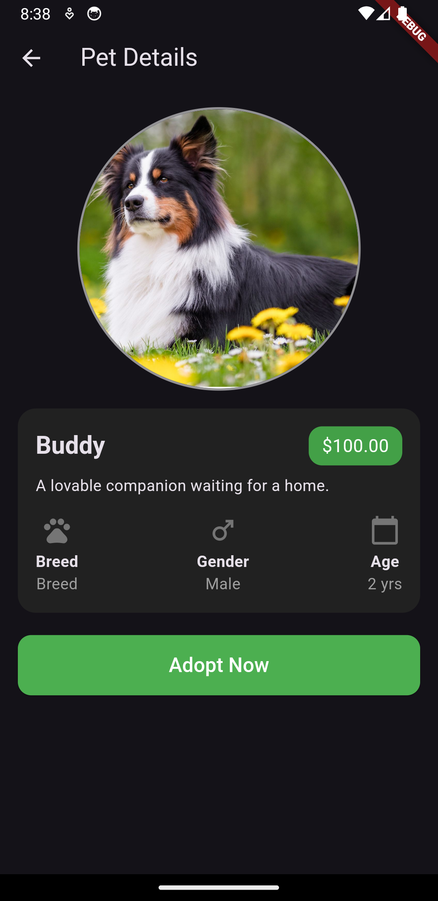
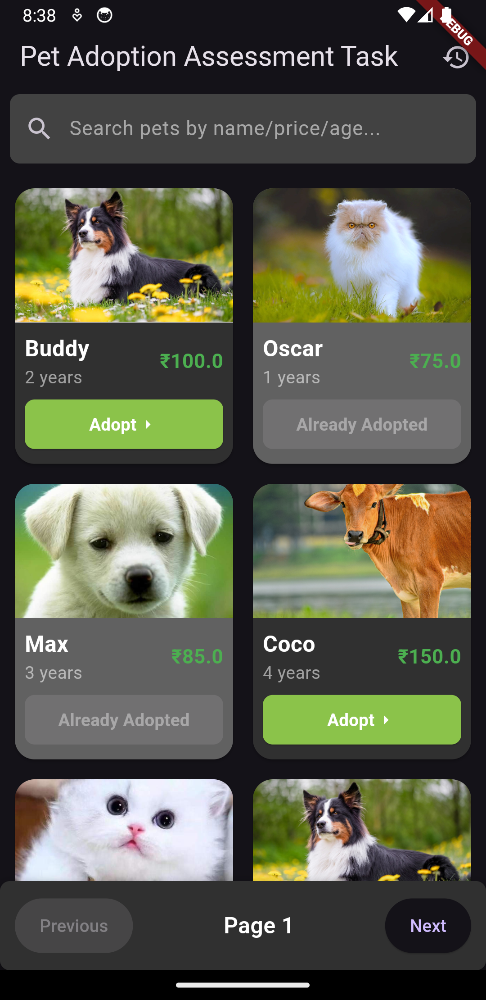

# Pet Adoption App - Flutter

## Overview
The Pet Adoption App is a Flutter-based mobile application designed to display a list of adoptable pets, provide detailed information about each pet, and track the adoption history. Users can view pets, adopt them, and view their adoption history in a beautifully designed interface with dark theme support.

## Screenshots
### Home Page


### Details Page


### History Page


## Features
### 1. Home Page
- Displays a list of pet animals available for adoption.
- Supports searching for pets by name.
- Pets are shown with their names, images, and adoption status.
- Optionally supports pagination for listing pets.
  
### 2. Details Page
- Displays detailed information about a selected pet, including:
  - Name, Age, Price, and Image.
  - An "Adopt Me" button.
- Clicking on the pet’s image opens an interactive viewer with zoom-in/zoom-out functionality.
- Clicking the "Adopt Me" button triggers a popup with a message: “You’ve adopted <pet_name>.”
- Optionally, the adoption popup includes confetti animation.
- Adopted pets are grayed out and marked as “Already Adopted.”

### 3. History Page
- Displays a chronological list of adopted pets.
- Can be shown as a simple list or a timeline.

### 4. General Features
- Hero animation for smooth navigation between the list and details page.
- Attractive and interactive UI with dark theme support.

## Technology Stack
- **Flutter**: For building the cross-platform mobile app.
- **BLoC**: State management used to manage the state across the app.
- **Flutter Hero Animations**: For smooth navigation transitions.
- **Dark Theme Support**: UI supports both light and dark modes.
- **Confetti Animation**: Used in the adoption popup for added interactivity (optional feature).

## Code Guidelines
- The app follows the **SOLID Design Principles**.
- Clean Code guidelines have been followed.
- **BLoC Pattern** is used for state management.
- Unit, Widget, and Integration tests (optional) are included.

## Installation
1. Clone the repository:
   ```bash
   git clone https://github.com/regunath-siva/pet-adoption-app.git


## License
This project is licensed under the MIT License - see the [LICENSE](LICENSE) file for details.

